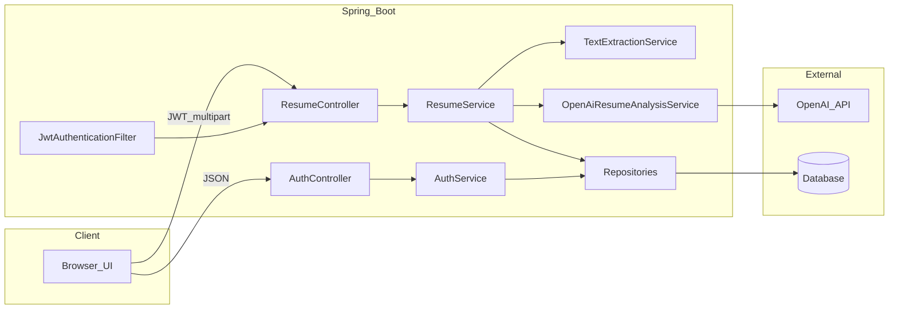

# AI-Powered Resume Analyzer — Full Project Documentation

This document describes the **Resume Analyzer** Spring Boot application: architecture, modules, configuration, APIs, security, AI integration, frontend, testing, and operations. For a shorter quickstart, see [README.md](README.md).

---

## 1. Overview

| Item | Description |
|------|-------------|
| **Purpose** | Web app where users register, upload a resume (PDF / Word), receive structured AI feedback (skills, improvements, ATS-style score, summary), and view past analyses. |
| **Stack** | Java 17+, Spring Boot 3.4.x, Maven, Spring Web, Spring Data JPA, Spring Security (JWT), WebFlux `WebClient`, Apache Tika, jjwt, MySQL (prod) / H2 (dev). |
| **Pattern** | Layered API: **Controller → Service → Repository** with DTOs and a global exception handler. |

---

## 2. High-level architecture



**Request flow (analyze):** `ResumeController` → `ResumeService` → `TextExtractionService` (Tika) → `OpenAiResumeAnalysisService` (HTTP) → persist `ResumeAnalysis` → return `AnalysisResponse`.

---

## 3. Repository layout

```
resume-analyzer/
├── pom.xml
├── README.md
├── DOCUMENTATION.md          ← this file
├── .gitignore
├── src/main/java/com/example/resumeanalyzer/
│   ├── ResumeAnalyzerApplication.java
│   ├── config/
│   │   ├── JwtProperties.java
│   │   ├── OpenAiProperties.java
│   │   ├── SecurityConfig.java
│   │   └── WebClientConfig.java
│   ├── controller/
│   │   ├── AuthController.java
│   │   └── ResumeController.java
│   ├── dto/
│   │   ├── RegisterRequest.java
│   │   ├── LoginRequest.java
│   │   ├── AuthResponse.java
│   │   ├── AnalysisResponse.java
│   │   ├── AnalysisHistoryItemDto.java
│   │   └── ImprovementDto.java
│   ├── entity/
│   │   ├── User.java
│   │   └── ResumeAnalysis.java
│   ├── repository/
│   │   ├── UserRepository.java
│   │   └── ResumeAnalysisRepository.java
│   ├── service/
│   │   ├── AuthService.java
│   │   ├── JwtService.java
│   │   ├── UserDetailsServiceImpl.java
│   │   ├── ResumeService.java
│   │   ├── TextExtractionService.java
│   │   └── OpenAiResumeAnalysisService.java
│   ├── security/
│   │   ├── JwtAuthenticationFilter.java
│   │   └── RestAuthenticationEntryPoint.java
│   └── exception/
│       ├── ApiException.java
│       ├── ErrorResponse.java
│       └── GlobalExceptionHandler.java
├── src/main/resources/
│   ├── application.properties
│   ├── application-dev.properties
│   ├── application-prod.properties
│   └── static/
│       ├── index.html
│       ├── styles.css
│       └── app.js
└── src/test/java/...           (unit / slice tests)
└── src/test/resources/
    ├── application.properties
    └── application-test.properties
```

### Layer responsibilities

| Layer | Responsibility |
|--------|----------------|
| **controller** | HTTP mapping, input binding, delegates to services, returns DTOs. |
| **service** | Business rules, orchestration, OpenAI and Tika calls, JWT issuance logic (via `JwtService`). |
| **repository** | Spring Data JPA persistence. |
| **entity** | JPA domain model and table mapping. |
| **dto** | API contracts (validation on requests). |
| **config** | Security filter chain, beans (`WebClient`), typed configuration (`@ConfigurationProperties`). |
| **security** | JWT filter, JSON 401 entry point for APIs. |
| **exception** | Consistent error JSON via `@RestControllerAdvice`. |

---

## 4. Data model

### User (`users`)

| Field | Notes |
|--------|--------|
| `id` | Primary key. |
| `email` | Unique, used as login username. |
| `password` | BCrypt hash. |
| `createdAt` | Audit timestamp. |

### ResumeAnalysis (`resume_analyses`)

| Field | Notes |
|--------|--------|
| `id` | Primary key. |
| `user` | Many-to-one → `User`. |
| `originalFilename` | Client file name. |
| `mimeType` | Optional MIME type. |
| `extractedTextExcerpt` | Truncated excerpt of extracted text (privacy / size). |
| `aiRawResponse` | Full model JSON string (LONGTEXT). |
| `atsScore` | Parsed integer 0–100 when available. |
| `createdAt` | When analysis was stored. |

---

## 5. REST API

Base URL (local): `http://localhost:8080`

| Method | Path | Auth | Description |
|--------|------|------|-------------|
| `POST` | `/api/auth/register` | No | Body: `RegisterRequest` (`email`, `password` min 8). Returns `AuthResponse` + HTTP 201. |
| `POST` | `/api/auth/login` | No | Body: `LoginRequest`. Returns `AuthResponse`. |
| `POST` | `/api/resumes/analyze` | Bearer JWT | `multipart/form-data`, field name **`file`**. PDF / `.doc` / `.docx`. |
| `GET` | `/api/resumes/history?limit=N` | Bearer JWT | `N` clamped (e.g. 1–100). Newest first. |

### Auth response shape

```json
{
  "token": "<jwt>",
  "email": "user@example.com",
  "expiresInMs": 86400000
}
```

### Analysis response shape

```json
{
  "analysisId": 1,
  "createdAt": "2026-04-12T12:00:00Z",
  "skills": ["Java", "Spring Boot"],
  "improvements": [
    { "area": "Formatting", "suggestion": "Use consistent date formats." }
  ],
  "atsScore": 75,
  "summary": "Short narrative summary."
}
```

### Error response shape (`ErrorResponse`)

```json
{
  "timestamp": "2026-04-12T12:00:00Z",
  "status": 400,
  "error": "Bad Request",
  "message": "Validation failed",
  "path": "/api/auth/register",
  "details": ["password: size must be between 8 and 128"]
}
```

---

## 6. Security

- **Stateless JWT:** No server session; `Authorization: Bearer <token>` on protected routes.
- **Public:** `/api/auth/**`, static welcome page and assets (`/`, `/index.html`, `/styles.css`, `/app.js`, `/favicon.ico`), `/h2-console/**` (dev).
- **Protected:** `/api/resumes/**`.
- **Passwords:** `BCryptPasswordEncoder`.
- **JWT signing:** HS256; secret from `JWT_SECRET` / `app.jwt.secret` — **must be at least 32 bytes** (UTF-8 string length).
- **401:** `RestAuthenticationEntryPoint` returns JSON for unauthenticated API access.

---

## 7. AI integration (OpenAI)

- **Endpoint:** `POST {baseUrl}/v1/chat/completions` (default base `https://api.openai.com`).
- **Client:** `WebClient` bean from `WebClientConfig` (connect / response timeouts from `OpenAiProperties`).
- **Auth:** `Authorization: Bearer ${OPENAI_API_KEY}`.
- **Model:** `OPENAI_MODEL` / `app.openai.model` (default `gpt-4o-mini`).
- **Response format:** `response_format: { "type": "json_object" }` with a system prompt requiring keys: `skills`, `improvements` (`area`, `suggestion`), `atsScore`, `summary`.
- **Input size:** Resume text sent to the model is truncated to `app.resume.max-chars-for-ai` (default 15000 characters) before the API call.
- **Failure behavior:** Missing API key → 503; HTTP errors from OpenAI → 502 with safe message; JSON parse issues → degraded parsed result where implemented (see `OpenAiResumeAnalysisService`).

Secrets must never be committed; use environment variables or your host’s secret store.

---

## 8. File upload and text extraction

- **Library:** Apache Tika (`tika-core`, `tika-parsers-standard-package`).
- **Flow:** Upload → temp file → `AutoDetectParser` + `BodyContentHandler` (character limit) → delete temp file.
- **Validation:** `ResumeService` checks extension (`.pdf`, `.doc`, `.docx`); Spring limits multipart size via `spring.servlet.multipart.*` (default 10 MB in `application.properties`).

---

## 9. Configuration and profiles

| File | Role |
|------|------|
| `application.properties` | Shared settings: multipart, JWT/OpenAI property keys, `app.resume.max-chars-for-ai`, default profile `dev` via `spring.profiles.default`. |
| `application-dev.properties` | In-memory H2, `ddl-auto=update`, H2 console. |
| `application-prod.properties` | MySQL datasource from `SPRING_DATASOURCE_*`, `ddl-auto=update` (adjust for your policy). |

### Environment variables (summary)

| Variable | Purpose |
|----------|---------|
| `OPENAI_API_KEY` | OpenAI secret key. |
| `OPENAI_MODEL` | Model id. |
| `OPENAI_BASE_URL` | Optional API base URL. |
| `JWT_SECRET` | JWT HMAC secret (≥ 32 chars). |
| `JWT_EXPIRATION_MS` | Token lifetime. |
| `SPRING_PROFILES_ACTIVE` | Set to `prod` for MySQL. |
| `SPRING_DATASOURCE_URL` / `USERNAME` / `PASSWORD` | Production database. |

---

## 10. Frontend (static)

- **Location:** `src/main/resources/static/`.
- **Behavior:** Login / register tabs; JWT in `localStorage`; multipart upload with `Authorization` header; renders skills, improvements, ATS score, summary; loads history table from `/api/resumes/history`.
- **CORS:** Not required when UI is served from the same origin as the API.

---

## 11. Testing

- **Profile:** Tests use `@ActiveProfiles("test")` and `application-test.properties` (H2).
- **Examples:** `AuthControllerTest` (`@SpringBootTest` + `@MockBean` for `AuthService`), `UserRepositoryTest` (`@DataJpaTest`), `JwtServiceTest` (plain unit test).
- **Command:** `mvn test` from project root.

---

## 12. Build and run

```bash
mvn -B package
java -jar target/resume-analyzer-0.0.1-SNAPSHOT.jar
```

Local development:

```bash
export OPENAI_API_KEY=sk-...   # or Windows: set OPENAI_API_KEY=sk-...
mvn spring-boot:run
```

Open [http://localhost:8080/](http://localhost:8080/).

---

## 13. Deployment (summary)

- **Render / similar:** MySQL (or compatible JDBC), set env vars (`SPRING_PROFILES_ACTIVE=prod`, datasource, `JWT_SECRET`, `OPENAI_API_KEY`), build `mvn -B package -DskipTests`, start `java -jar target/resume-analyzer-0.0.1-SNAPSHOT.jar`.
- **AWS:** RDS MySQL + compute (EC2, Beanstalk, ECS) + ALB for TLS; same env vars; restrict RDS security group to app tier.

Details and copy-paste examples: [README.md](README.md).

---

## 14. Troubleshooting

| Symptom | Likely cause |
|---------|----------------|
| 503 “OpenAI API key is not configured” | `OPENAI_API_KEY` unset or empty. |
| 502 from analyze | Invalid key, billing, model name, or upstream outage. |
| 401 on `/api/resumes/*` | Missing/expired JWT or wrong `Authorization` header format. |
| JWT validation errors | `JWT_SECRET` changed between token issue and validation, or secret too short. |
| Empty / failed text extraction | Corrupt file or unsupported binary; try PDF or DOCX. |

---

## 15. Related files

- [README.md](README.md) — Quickstart, Postman/cURL samples, example JSON, deploy checklist.
- [pom.xml](pom.xml) — Dependencies and Spring Boot parent version.

---

*Generated for the Resume Analyzer codebase. Update this file when you change endpoints, entities, or deployment steps.*
